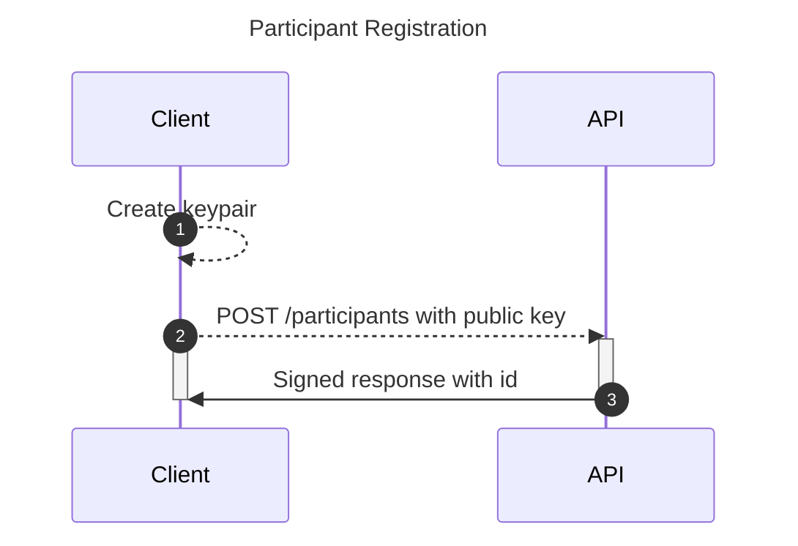
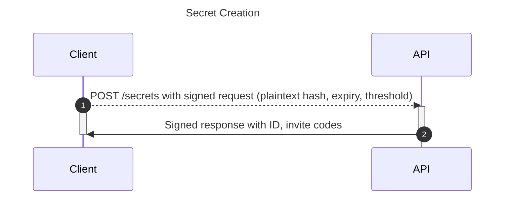
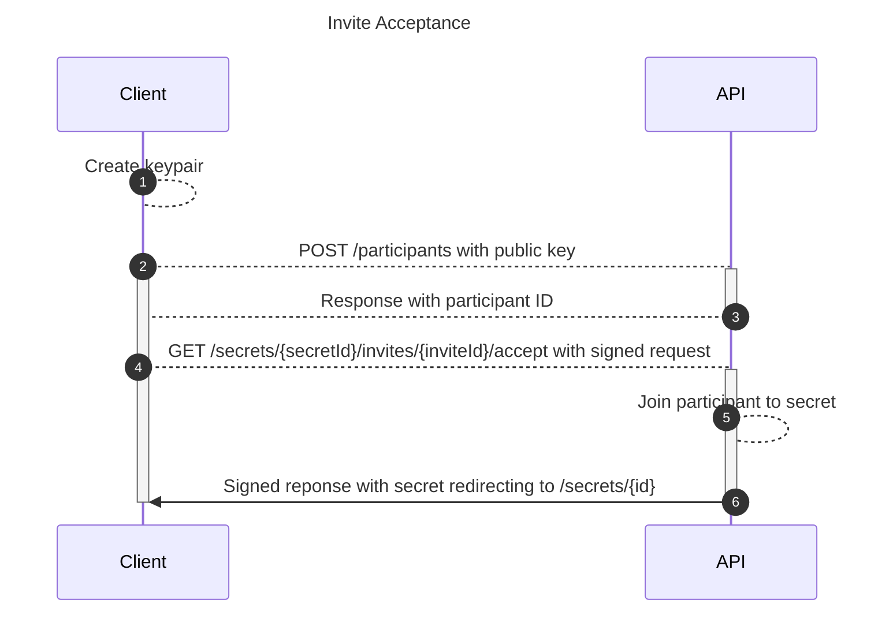
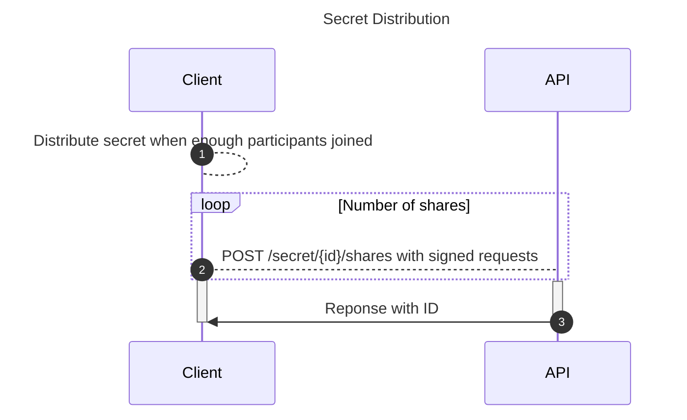
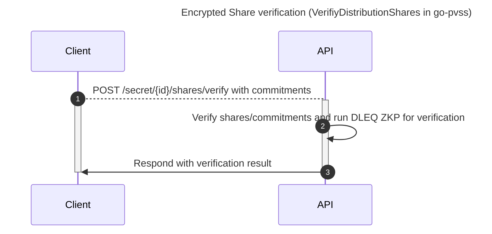
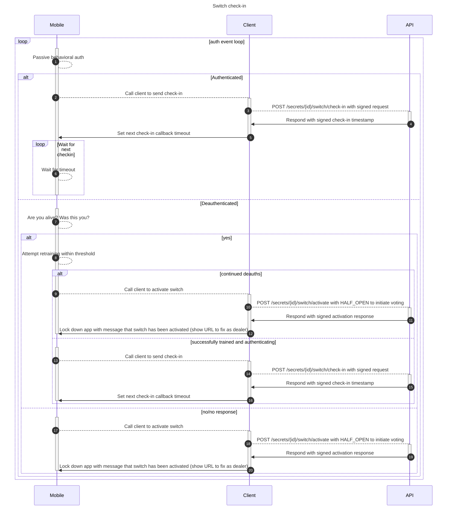
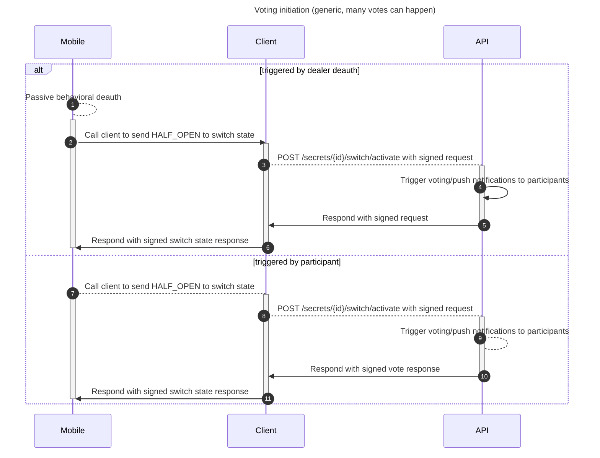
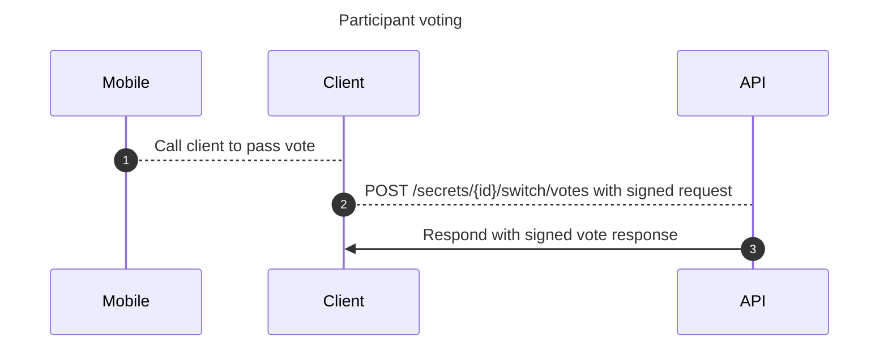
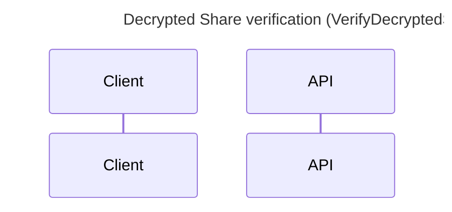
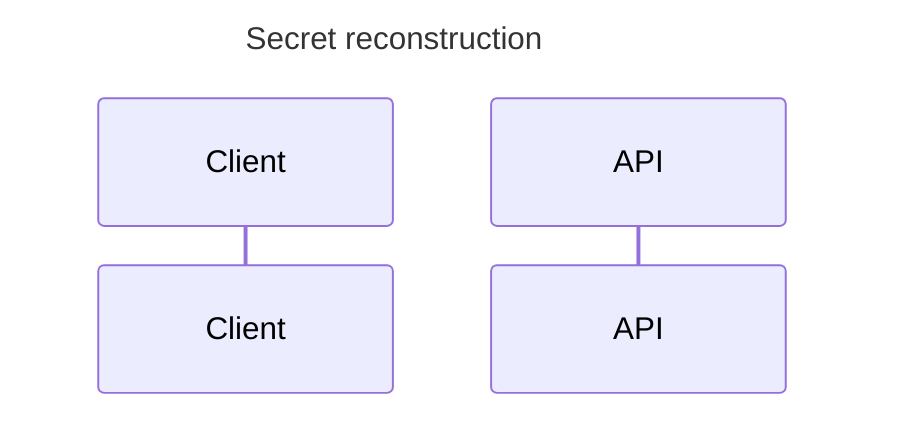

```mermaid
---
title: Participant Registration
---

sequenceDiagram
    autoNumber
    participant C as Client
    participant SOR as API

    C-->>C: Create keypair
    C-->>SOR: POST /participants with public key
    activate C
    activate SOR
        SOR->>C: Signed response with id
    deactivate SOR
    deactivate C
```

```mermaid
---
title: Secret Creation
---

sequenceDiagram
    autoNumber
    participant C as Client
    participant SOR as API

    C-->>SOR: POST /secrets with signed request (plaintext hash, expiry, threshold)
    activate C
    activate SOR
    SOR->>C: Signed response with ID, invite codes
    deactivate SOR
    deactivate C
```

```mermaid
---
title: Invite Acceptance
---
sequenceDiagram
    autoNumber
    participant C as Client
    participant SOR as API

    C-->C: Create keypair
    C-->SOR: POST /participants with public key
    activate C
    activate SOR
    SOR-->C: Response with participant ID
    deactivate SOR
    C-->SOR: GET /secrets/{secretId}/invites/{inviteId}/accept with signed request
    activate SOR
    SOR-->SOR: Join participant to secret
    SOR->>C: Signed reponse with secret redirecting to /secrets/{id}
    deactivate SOR
    deactivate C
```

```mermaid
---
title: Secret Distribution
---
sequenceDiagram
    autoNumber
    participant C as Client
    participant SOR as API

    C-->C: Distribute secret when enough participants joined
    loop Number of shares
    C-->SOR: POST /secret/{id}/shares with signed requests
    end
    activate C
    activate SOR
    SOR->>C: Reponse with ID
    deactivate SOR
    deactivate C
```

```mermaid
---
title: Encrypted Share verification (VerifiyDistributionShares in go-pvss)
---
sequenceDiagram
    autoNumber
    participant C as Client
    participant SOR as API

    C-->SOR: POST /secret/{id}/shares/verify with commitments
    activate C
    activate SOR
    SOR->>SOR: Verify shares/commitments and run DLEQ ZKP for verification
    SOR->>C: Respond with verification result
    deactivate SOR
    deactivate C
```

```mermaid
---
title: Switch check-in
---
sequenceDiagram
    autoNumber
    participant M as Mobile
    participant C as Client
    participant SOR as API

    loop auth event loop
    activate M
    M-->M: Passive behavioral auth
    alt Authenticated
        M-->C: Call client to send check-in
        activate C
        C-->SOR: POST /secrets/{id}/switch/check-in with signed request
        activate SOR
        SOR->>C: Respond with signed check-in timestamp
        deactivate SOR
        C->>M: Set next check-in callback timeout
        deactivate C
        loop Wait for next checkin
            M-->M: Wait for timeout
        end
        deactivate M
    else Deauthenticated
        activate M
        M-->M: Are you alive? Was this you?
        alt yes
            M-->M: Attempt retraining within threshold
            alt continued deauths
                M-->C: Call client to activate switch
                activate C
                C-->SOR: POST /secrets/{id}/switch/activate with HALF_OPEN to initiate voting
                activate SOR
                SOR->>C: Respond with signed activation response
                deactivate SOR
                C->>M: Lock down app with message that switch has been activated (show URL to fix as dealer)
                deactivate C
                deactivate M
            else successfully trained and authenticating
                activate M
                M-->C: Call client to send check-in
                activate C
                C-->SOR: POST /secrets/{id}/switch/check-in with signed request
                activate SOR
                SOR->>C: Respond with signed check-in timestamp
                deactivate SOR
                C->>M: Set next check-in callback timeout
                deactivate C
                deactivate M
            end
        else no/no response
            activate M
            M-->C: Call client to activate switch
            activate C
            C-->SOR: POST /secrets/{id}/switch/activate with HALF_OPEN to initiate voting
            activate SOR
            SOR->>C: Respond with signed activation response
            deactivate SOR
            C->>M: Lock down app with message that switch has been activated (show URL to fix as dealer)
            deactivate C
            deactivate M
        end
    end
    end
```

```mermaid
---
title: Voting initiation (generic, many votes can happen)
---
sequenceDiagram
    autoNumber
    participant M as Mobile
    participant C as Client
    participant SOR as API

    alt triggered by dealer deauth
        M-->M: Passive behavioral deauth
        activate M
        M->>C: Call client to send HALF_OPEN to switch state
        activate C
        C-->SOR: POST /secrets/{id}/switch/activate with signed request
        activate SOR
        SOR->>SOR: Trigger voting/push notifications to participants
        SOR->>C: Respond with signed request
        deactivate SOR
        C->>M: Respond with signed switch state response
        deactivate C
        deactivate M
    else triggered by participant
        M-->C: Call client to send HALF_OPEN to switch state
        activate M
        activate C
        C-->SOR: POST /secrets/{id}/switch/activate with signed request
        activate SOR
        SOR-->SOR: Trigger voting/push notifications to participants
        SOR->>C: Respond with signed vote response
        deactivate SOR
        C->>M: Respond with signed switch state response
        deactivate C
        deactivate M
    end
```

```mermaid
---
title: Participant voting
---

sequenceDiagram
    autoNumber
    participant M as Mobile
    participant C as Client
    participant SOR as API

    M-->C: Call client to pass vote
    C-->SOR: POST /secrets/{id}/switch/votes with signed request
    SOR->>C: Respond with signed vote response
```

```mermaid
---
title: Decrypted Share verification (VerifyDecryptedShare in go-pvss)
---
sequenceDiagram
    autoNumber
    participant C as Client
    participant SOR as API

    
```

```mermaid
---
title: Secret reconstruction
---
sequenceDiagram
    autoNumber
    participant C as Client
    participant SOR as API

```

