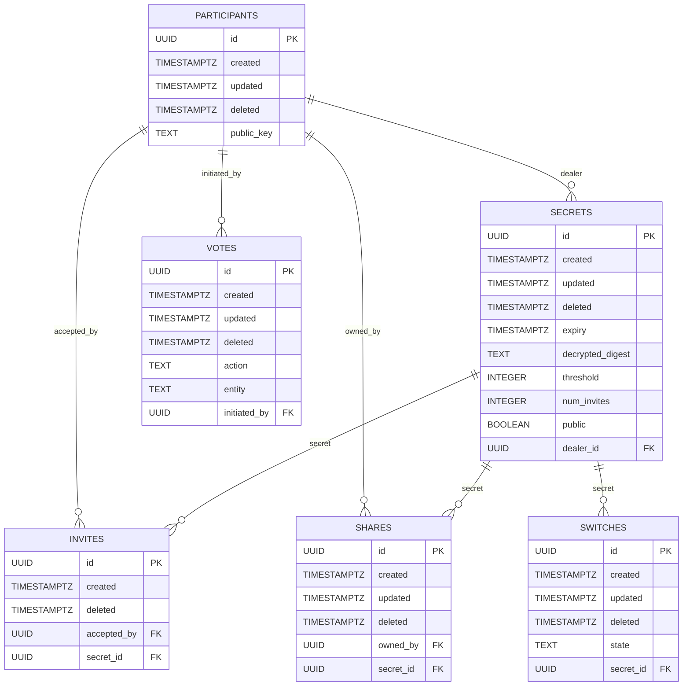

# ERD

```mermaid
erDiagram
    PARTICIPANTS {
        UUID id PK
        TIMESTAMPTZ created
        TIMESTAMPTZ updated
        TIMESTAMPTZ deleted
        TEXT public_key
    }

    SECRETS {
        UUID id PK
        TIMESTAMPTZ created
        TIMESTAMPTZ updated
        TIMESTAMPTZ deleted
        TIMESTAMPTZ expiry
        TEXT decrypted_digest
        INTEGER threshold
        INTEGER num_invites
        BOOLEAN public
        UUID dealer_id FK
    }

    INVITES {
        UUID id PK
        TIMESTAMPTZ created
        TIMESTAMPTZ deleted
        UUID accepted_by FK
        UUID secret_id FK
    }

    SHARES {
        UUID id PK
        TIMESTAMPTZ created
        TIMESTAMPTZ updated
        TIMESTAMPTZ deleted
        UUID owned_by FK
        UUID secret_id FK
    }

    VOTES {
        UUID id PK
        TIMESTAMPTZ created
        TIMESTAMPTZ updated
        TIMESTAMPTZ deleted
        TEXT action
        TEXT entity
        UUID initiated_by FK
    }

    SWITCHES {
        UUID id PK
        TIMESTAMPTZ created
        TIMESTAMPTZ updated
        TIMESTAMPTZ deleted
        TEXT state
        UUID secret_id FK
    }

    PARTICIPANTS ||--o{ SECRETS : "dealer"
    PARTICIPANTS ||--o{ INVITES : "accepted_by"
    PARTICIPANTS ||--o{ SHARES : "owned_by"
    PARTICIPANTS ||--o{ VOTES : "initiated_by"
    SECRETS ||--o{ INVITES : "secret"
    SECRETS ||--o{ SHARES : "secret"
    SECRETS ||--o{ SWITCHES : "secret"

```
