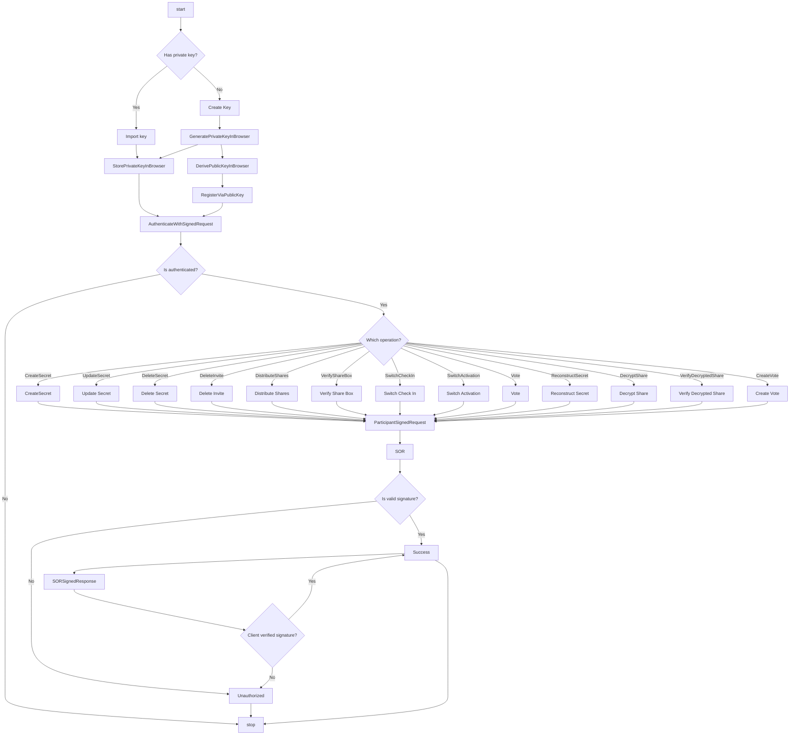

# Protocol

- [Crypto](./CRYPTO.md)
- [Key ownership](./KEY-OWNERSHIP.md)

## Operations

- Unauthenticated
    - CreateKeypair
        - Within CreateKeys - new user; a user generates an P256 keypair in their browser
    - ImportPrivateKey
        - Within UploadKeys - existing user; a previous user is provided their keypair to authenticate
    - RegisterWithKey (Entry in SOR with public key)
        - Within RegisterKey - a user sends an unsigned HTTPS request with their public key hex to register into the platform, only exposed for CreateKeys
- Authenticated
    - CreateSecret (Entry in SOR with owned secret, invites created and returned)
        - Within CreateSecret - A user sends a signed HTTPS request with the threshold for reconstruction and number of invites to create
    - ProtocolJoin (2 states: auth/no-auth)
        - Redirect to create/upload keys if unauthenticated, otherwise get identifier from signature and accept invite.
    - UpdateSecret (Entry in SOR modified)
        - User modifies the the secret with a signed request, if protocol is active the secret is redistributed
    - DeleteSecret (Entry in SOR modified)
        - User deletes the the secret with a signed request, if protocol is active the shares, invites, votes, and switches are removed
    - DistributeShares (Shares created after accepted invites exceeds threshold, redistributes every acceptance after, and endpoint exposed to prove decryption with participant keys)
    - VerifyShareBox (Participants can verify that the sharebox offers a valid decryption once shares are created)
    - Vote (Participants can participate in a vote, or create a vote at any time, some votes may be initiated by rules/deauth)
    - SwitchActivation (The switch goes from HALF_OPEN to closed meaning voting succeeded and the secret will now be released. Participants will be able to access their individual shares at this time)
    - DecryptShare (A user can now decrypt their released share and upload it for other participants)
    - VerifyDecryptedShare (A participant can verify the decrypted share for other users)
    - ReconstructSecret (A participant will combine the decrypted shares to recover the secret)
    - ActivateSwitch (A dealer or agent will change the switch state to CLOSED, effectively releasing shares for reconstruction)
    - CreateVote (A participant will call a vote amongst trustees)
    - Vote (A participant will participate in an active vote)

## Flow Chart

**TODO**

- Will we ever need our public key loaded into the browser client-side?

